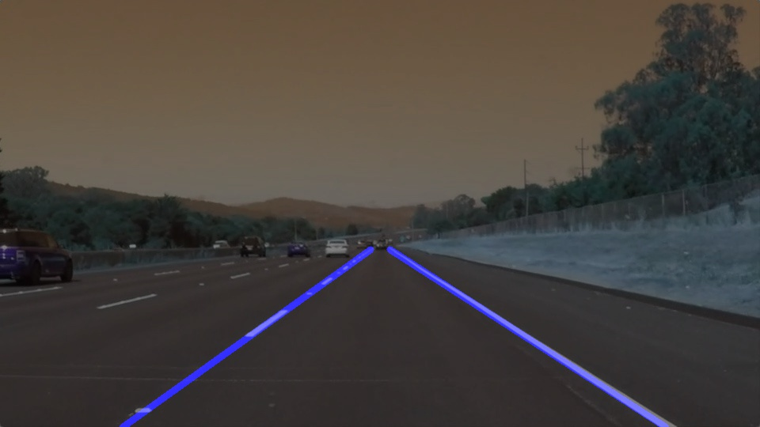
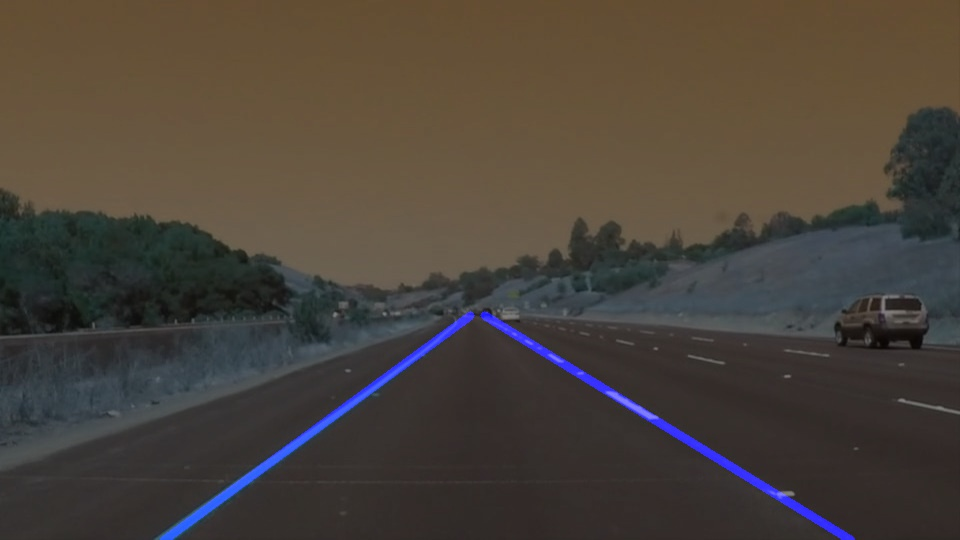
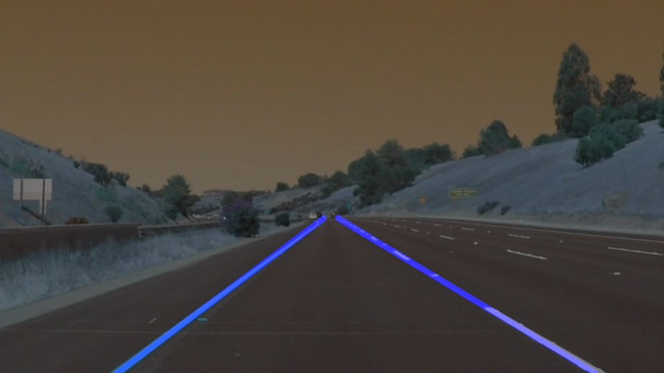
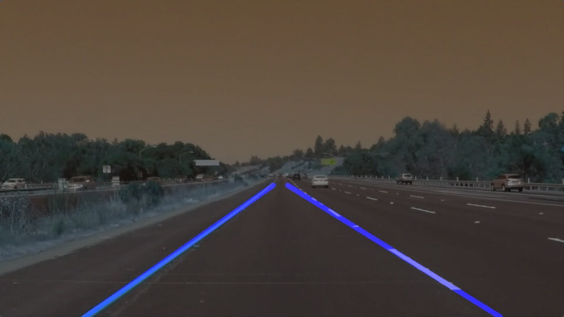
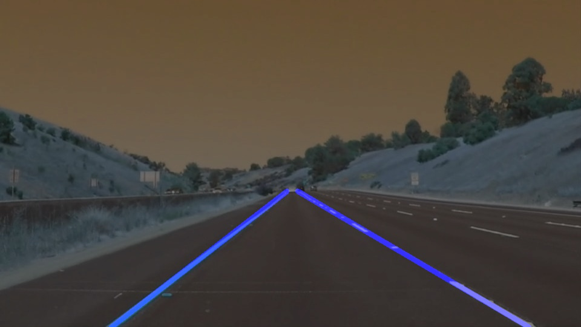

# Finding Lane Lines on the Road
### Requirements: OpenCv and moviepy libraries
### Language: Python3
#### To Run the notebook(P1.ipynb) ipython-notebook would be required. 

#### Goal: To find the lanes of the road from example videos. [video1](test_videos/solidWhiteRight.mp4) and [video2](test_videos/solidYellowLeft.mp4) 
#### Example results: [Example_vid1](examples/P1_example.mp4) and [Example_vid2](examples/raw-lines-example.mp4)

### Reflection:
I worked through the project by building a Image processing pipeline which has following steps:
1. Grayscale conversion: 
2. Gaussian Blur 
3. Canny Edge Detection 
4. Finding the region of interest  
5. Hough Transform to find the tracks 
6. Extrapolating the points to find the most suitable line. 

For moving for from step 1 through 5, the course content was very helpful. Finally for step six, I modified the draw_lines() function.

    
1. First of all the segments with slopes between -0.6 to -0.9 were considered for the left lane. And segments with slope between 0.45 to 0.75 were considered for the right lane. The average slope was calculated to deter mine the final slope for both.
2. Average of points on left line segment gives the average point that left lane line passes through. Same for the right lane.
3. Slope and average points are used to come up with the line in the region of interest for both lanes.

### Identify potential shortcomings with your current pipeline:
The constraints for the slopes in draw_lines() make the model less accurate as lots of the lines are not considered. 

###  Suggest possible improvements to your pipeline:
The possible improvements could be making the bounds of the slopes to be more flexible. Extending the same project to find the best constraints for the curved paths could be another great improvement.

### Results for the test images are presented below:

